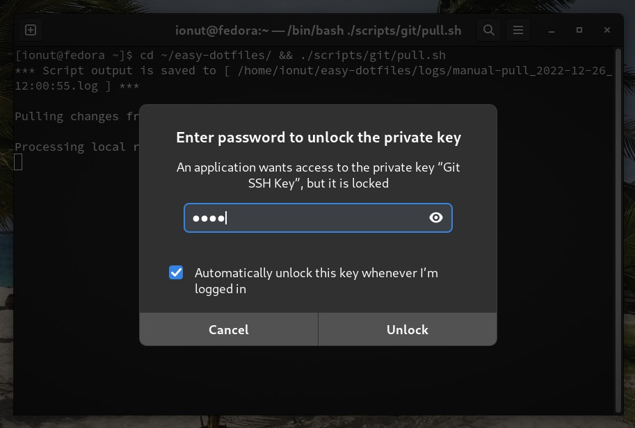
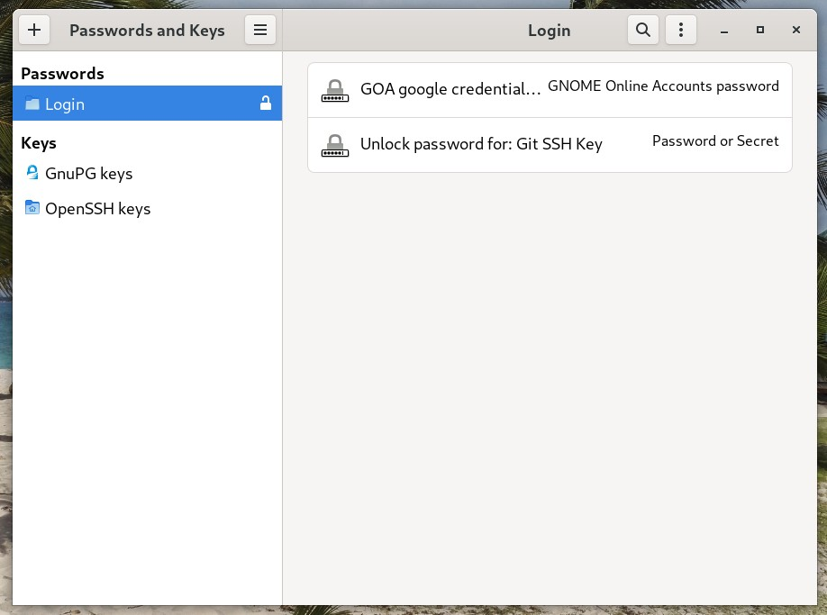

<!-- start header -->

[<< Back to contents][contents doc url]

---

<!-- end header -->

<!-- start TOC -->

- [Scheduling automatic actions](#scheduling-automatic-actions)
  - [Git SSH keys](#git-ssh-keys)
  - [Export](#export)
  - [Import](#import)
  - [Remove or reschedule](#remove-or-reschedule)

<!-- end TOC -->

## Scheduling automatic actions

**`easy-dotfiles`** can help in scheduling automatic **exports** or **imports**, **to** or **from** your private git repository. The scheduling is done with the help of the [anacron](https://en.wikipedia.org/wiki/Anacron) package.

Don't worry, you don't have to learn anything about the `anacron` tool :sweat_smile:. **`easy-dotfiles`** has a nice [anacron setup][anacron setup script] script that helps you in scheduling the desired action.

:exclamation:**NOTE:** We **assume** that you **already** have your local installation of **`easy-dotfiles`** properly configured and you **already** succeeded in performing manual `export`, `import`, `push` and `pull` actions against your private repository.

### Git SSH keys

As it was recommended in the [Quick demo][quick demo doc url] section, you should have used [SSH authentication](https://docs.github.com/en/authentication/connecting-to-github-with-ssh) for connecting to your `git` repositories. Because we want the `automatic actions` to be as non-interactive as possible, here are some tips on how we can achieve that by using SSH keys.

If you haven't already set up `git` [SSH authentication](https://docs.github.com/en/authentication/connecting-to-github-with-ssh), please go there first and follow through the guide.

You can use key passphrases and set a proper comment to the key when creating it, something like `Git SSH Key` or similar. The comment will help you identify for which private key you are prompted to unlock it.

If the key is already created, you can modify its comment by using this:

```sh
ssh-keygen -c -f ~/.ssh/your_key_file
```

When you're doing a `git` operation that requires authentication, you will be prompted to unlock the private key, if it's not already unlocked:



:exclamation:**NOTE:** Make sure to check `Automatically unlock this key whenever I'm logged in` so you won't have to unlock it each time the key is used.

This way, the git SSH key will be added to the `Login` keyring, as you can see after a re-login by using the [Passwords and Keys](https://wiki.gnome.org/Apps/Seahorse) app (package name is `seahorse`):



If you **don't use** a Gnome Shell **login password** and your user is logged in automatically, the `Login` keyring will not be unlocked until there is the need to use the keys stored inside. On `Fedora` I believe that you are asked to unlock the keyring right after the passwordless login, but in `Ubuntu` you are asked only when needed.

When **`easy-dotfiles`** automatic actions are scheduled to run, you will be prompted to unlock the private ssh key. If you have a meaningful comment attached to it, you'll know that it's probably the background job trying to access it and there's no need to panic :sweat_smile:

### Export

You installed and configured **`easy-dotfiles`** on your main desktop, you pushed your files and settings to the private repository, but what's next? :raised_eyebrow:

Well, you could repeat the [export][export script doc url] and [push][git scripts doc url] actions manually, from time to time, in order to keep your private repository up to date with the latest changes from your system.

Or, you could instead **schedule** an **automatic** `export` action that will do that for you:

```sh
cd ~/easy-dotfiles/ && ./scripts/anacron/setup.sh
```

When running the above mentioned script you need to select the `export` action and your preferred frequency: `daily`, `weekly` or `monthly`.

In order to see that the scheduled `export` did actually happen you need to wait an hour or so. Afterwards, you can check the **`easy-dotfiles`** logs for log file names beginning with:

- `daily-export`, `weekly-export` or `monthly-export`, depending on your configuration.
- `daily-push`, `weekly-push` or `monthly-push`, depending on your configuration.

The logs are located inside the `logs` folder from the **`easy-dotfiles`**'s project root:

```sh
cd ~/easy-dotfiles/logs/ && ls -l
```

If you're in a hurry and you don't want to wait in order to check the logs, you can force `anacron` to run immediately all the jobs:

```sh
sudo anacron -f -n
```

:exclamation:**NOTE:** You don't need to worry about deleting older logs, the files are automatically rotated and the previous three versions of a log file is kept inside the `~/easy-dotfiles/logs/history/` folder :sunglasses:

### Import

Usually, you won't need to schedule automatic `imports` from your private repository. But if you really need this use case, you can schedule it by using the same **`easy-dotfiles`** `anacron` setup script:

```sh
cd ~/easy-dotfiles/ && ./scripts/anacron/setup.sh
```

When running the above mentioned script you need to select the `import` action and your preferred frequency: `daily`, `weekly` or `monthly`.

In order to see that the scheduled `export` did actually happen you need to wait an hour or so (or force anacron to run immediately with `sudo anacron -f -n`). Afterwards, you can check the **`easy-dotfiles`** logs for log file names beginning with:

- `daily-import`, `weekly-import` or `monthly-import`, depending on your configuration.
- `daily-pull`, `weekly-pull` or `monthly-pull`, depending on your configuration.

:exclamation:**NOTE:** Scheduled `export` and `import` actions are **mutually exclusive**. This means that **`easy-dotfiles`** is **not able** to **configure both of them** at the **same time** on the **same machine**.

You need to choose on either schedule automatic `exports` **OR** automatic `imports` on the same machine.

_Why?_ Well, this is a _publisher_ - _subscriber_ like paradigm where the _publisher_ machine will `export` its data to the private repo and the _subscriber_ machine will `import` it. It doesn't make sense to have both _publisher_ and _subscriber_ on the same machine.

:exclamation:**NOTE:** Scheduling automatic `imports` on a _subscriber_ machine **won't automatically install** all the new apps and extensions that are added on the _publisher_ machine. You'll have the new apps and extensions settings imported to your _subscriber_ machine, but you'll need to also manually run the `install` script:

```sh
cd ~/easy-dotfiles/ && ./scripts/install.sh
```

### Remove or reschedule

If you want to **remove** an existing **`easy-dotfiles`** scheduled action or **reschedule** an action, you can always run again the `anacron` setup script:

```sh
cd ~/easy-dotfiles/ && ./scripts/anacron/setup.sh
```

Easy! :star_struck:

Well, you honestly deserve a medal :1st_place_medal: for reading all the docs up to this point, kudos to you! :100:

If you want to become an `expert lvl 999` user of **`easy-dotfiles`** there is the **last** and **final** chapter that talks about some sweet [tips and tricks][tips and tricks doc url].

<!-- start footer -->

---

[<< Back to contents][contents doc url]

<!-- end footer -->

<!-- start links -->

[sample folder]: ../sample
[sample config folder]: ../sample/config
[sample data folder]: ../sample/data
[sample scripts folder]: ../sample/scripts
[sample common setup script]: ../sample/scripts/common/setup.sh
[apps config json]: ../sample/config/apps/config.json
[apps data folder]: ../sample/data/apps
[extensions config json]: ../sample/config/extensions/config.json
[extensions data folder]: ../sample/data/extensions
[keybindings config json]: ../sample/config/keybindings/config.json
[keybindings data folder]: ../sample/data/keybindings
[misc config json]: ../sample/config/misc/config.json
[misc data folder]: ../sample/data/misc
[tweaks config json]: ../sample/config/tweaks/config.json
[tweaks data folder]: ../sample/data/tweaks

<!-- -->

[main scripts]: ../scripts
[install script]: ../scripts/install.sh
[export script]: ../scripts/export.sh
[import script]: ../scripts/import.sh
[remove script]: ../scripts/remove.sh
[git setup script]: ../scripts/git/setup.sh
[git push script]: ../scripts/git/push.sh
[git pull script]: ../scripts/git/pull.sh
[git reset script]: ../scripts/git/reset.sh
[anacron setup script]: ../scripts/anacron/setup.sh
[common setup script]: ../scripts/common/setup.sh
[defaults script]: ../sample/scripts/defaults.sh
[jidea install script]: ../sample/scripts/apps/jidea-install.sh
[fedora setup script]: ../sample/scripts/fedora/setup.sh
[ubuntu setup script]: ../sample/scripts/ubuntu/setup.sh

<!-- -->

[contents doc url]: ./README.md
[disclaimer doc url]: ./disclaimer.md#disclaimer
[quick demo doc url]: ./quick-demo.md#quick-demo
[main desktop setup doc url]: ./main-desktop-setup.md#main-desktop-setup
[json configuration doc url]: ./json-configuration.md#json-configuration
[shell scripts doc url]: ./shell-scripts.md#shell-scripts
[common setup script doc url]: ./shell-scripts.md#public-commonsetupsh-script
[private common setup script doc url]: ./shell-scripts.md#private-commonsetupsh-script
[distro specific setup script doc url]: ./shell-scripts.md#private-distro-specific-setupsh-script
[export script doc url]: ./shell-scripts.md#exportsh
[import script doc url]: ./shell-scripts.md#importsh
[install script doc url]: ./shell-scripts.md#installsh
[git scripts doc url]: ./shell-scripts.md#git-scripts
[distro setup scripts doc url]: ./shell-scripts.md#private-distro-specific-setupsh-script
[anacron setup script doc url]: ./shell-scripts.md#anacron-setup
[automatic actions doc url]: ./automatic-actions.md#scheduling-automatic-actions
[tips and tricks doc url]: ./tips-and-tricks.md#tips--tricks

<!-- end links -->
